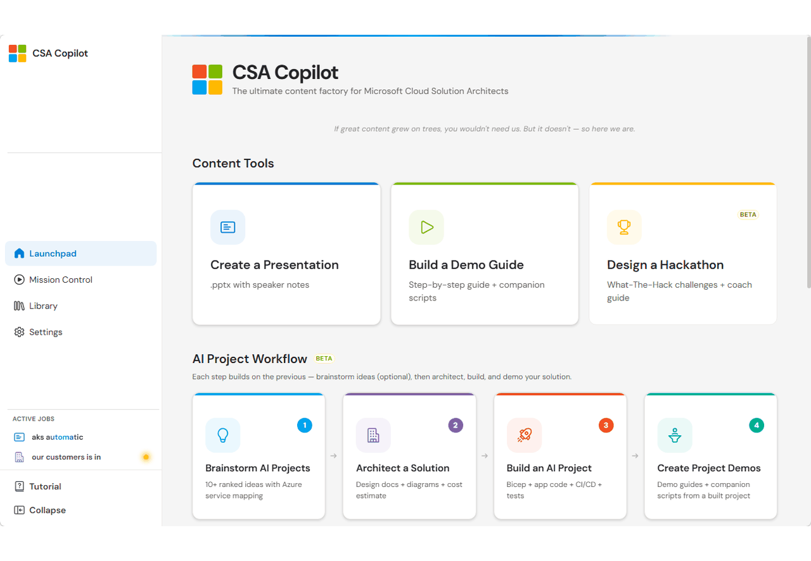
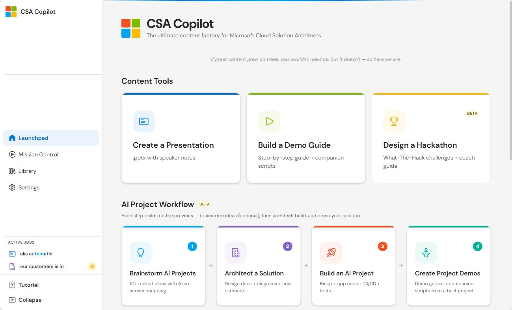
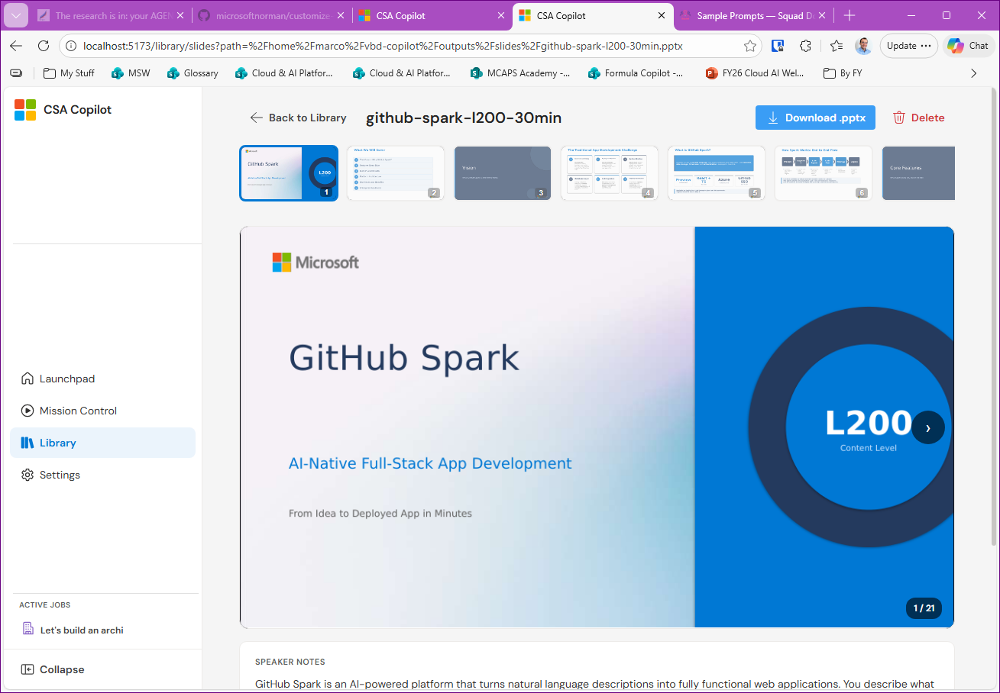
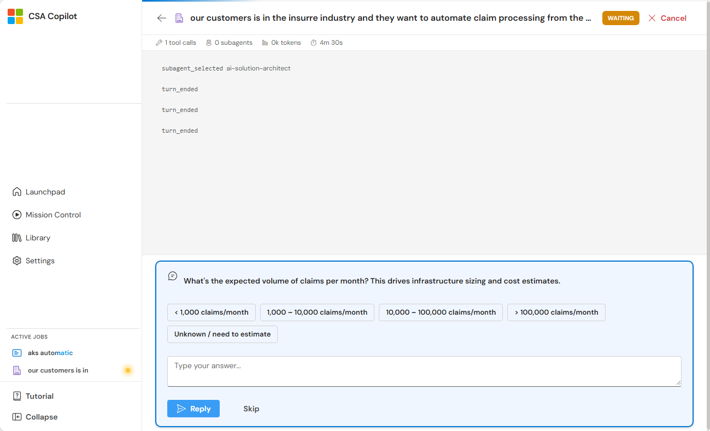
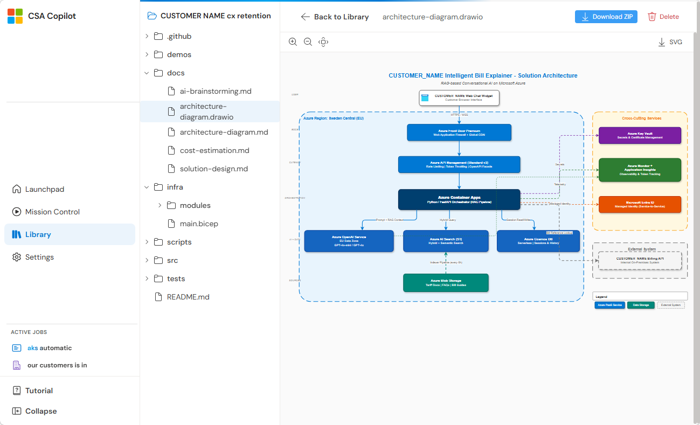
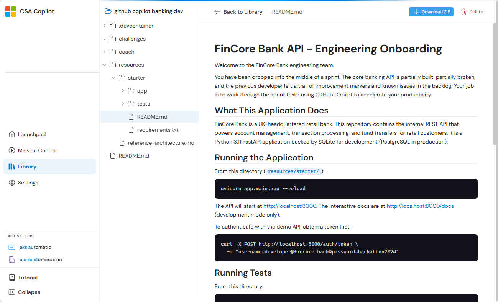

# CSA-Copilot

**Stop spending tonight copy-pasting from MS Learn.** CSA-Copilot turns a single prompt into slide decks, demo guides, hackathon packages, and full Azure projects — researched, built, and QA-checked by 27 AI agents. You describe what you need. They deliver. You review and present.

<p align="center">
  
</p>

---

## Get Running in 2 Minutes

You need a [GitHub Copilot](https://github.com/features/copilot) subscription and the [GitHub CLI](https://cli.github.com/) (`gh auth login`).

```bash
git clone https://github.com/olivomarco/vbd-copilot.git
cd vbd-copilot
./scripts/setup.sh            # one-time: venv + frontend deps
./scripts/dev.sh              # Browser UI → http://localhost:5173
./scripts/dev.sh --electron   # Desktop UI
./scripts/dev.sh --cli        # CLI (Docker)
```

> [!NOTE]
> **Windows users:** see [docs/INSTALLATION.md](docs/INSTALLATION.md#option-c--cli-via-docker) for Windows-specific Docker commands (`$(gh auth token)` doesn't work in CMD).

> [!TIP]
> `setup.sh` checks prerequisites (`gh`, `uv`, `node`) and installs everything. Pass `--with-system-deps` to also install LibreOffice and Poppler (PPTX thumbnails).

> [!WARNING]
> The **CLI** is battle-tested. The **Browser / Electron UI** is experimental — if something breaks, fall back to `--cli`.

More install options (Codespaces, Copilot plugin, native Python): [docs/INSTALLATION.md](docs/INSTALLATION.md)

---

## What It Does

Four workflows. Each one researches official sources, asks for your approval at checkpoints, and runs automated QA before delivery.

| Workflow | What you say | What you get | Time saved |
|----------|-------------|--------------|------------|
| **Presentations** | *"1-hour L300 deck on GitHub Copilot extensions"* | `.pptx` + speaker notes + generator script | 4-6h → ~1h |
| **Demos** | *"3 L300 demos on Azure Container Apps"* | Step-by-step guide + runnable scripts + troubleshooting table | 3-4h → ~30min |
| **AI Projects** | *"Automate claim processing for insurance"* | Brainstorm → architecture → Bicep + app code + CI/CD + tests | Days → ~1h |
| **Hackathons** | *"Full-day L300 hackathon on Container Apps"* | Challenges + coach solutions + dev container + scoring rubric | 1-2 days → ~1h |

> [!IMPORTANT]
> This is deep research, not instant generation. A deck takes ~1 hour — but that replaces 4-8 hours of manual work. Kick it off and do something else.

---

## See It in Action

<table>
<tr>
<td width="50%"><strong>Launchpad — pick your workflow</strong><br></td>
<td width="50%"><strong>Library — browse and preview outputs</strong><br></td>
</tr>
<tr>
<td><strong>AI agents ask clarifying questions</strong><br></td>
<td><strong>Full architecture diagrams, auto-generated</strong><br></td>
</tr>
<tr>
<td><strong>Hackathon packages ready for Codespaces</strong><br></td>
<td><strong>CLI — same power, no browser needed</strong><br></td>
</tr>
</table>

### Sample slide output (raw, unedited)

| | | | | |
|:---:|:---:|:---:|:---:|:---:|
|  |  |  |  |  |
| Title slide | Section divider | Content slide | Deep dive | Architecture |

Browse all samples: [slides](samples/slides/README.md) · [demos](samples/demos/README.md) · [hackathons](samples/hackathons/README.md) · [AI projects](samples/ai-projects/README.md)

---

## Quick Reference

### Content levels

| Level | Audience | What it looks like |
|-------|----------|-------------------|
| **L100** | Executives | Value props, no code |
| **L200** | Technical decision makers | Architecture, key concepts |
| **L300** | Practitioners | Code samples, implementation patterns |
| **L400** | Experts | Internals, performance tuning |

### Prompt examples

```text
"Create a 15min L200 briefing on what's new in AKS"
"Build a 30min deck from notes/aks-security-review.md"
"@ai-brainstorming AI use cases for a healthcare company"
"@ai-solution-architect Design architecture for idea #3"
"@ai-implementor Implement the solution"
"@hackathon-conductor 4-hour L300 hackathon on AKS"
/resume                    # pick up where you left off
/model                     # switch models mid-session
```

---

## Quality Gates

Every output passes through multiple checks before delivery. Details: [docs/QUALITY.md](docs/QUALITY.md)

- Research restricted to official sources (MS Learn, docs.github.com, devblogs, techcommunity)
- Human approval stops before builds and before delivery
- Automated QA validators for PPTX, architecture, infra, pipelines, docs, and hackathons
- Content humanization — AI-tell detection with automatic rewrites
- 4-reviewer gate on AI projects (code, infra, pipeline, docs must all approve)
- 80% test coverage enforced via `pytest --cov`

---

## More

- [Full usage guide & commands](docs/USAGE.md)
- [All installation options](docs/INSTALLATION.md)
- [Responsible AI policy](docs/RESPONSIBLE-AI.md)
